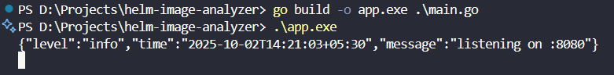
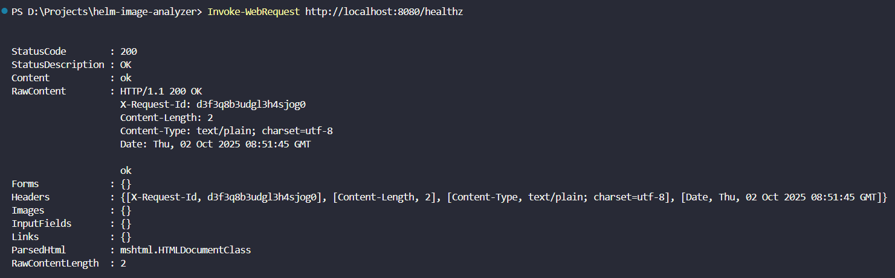
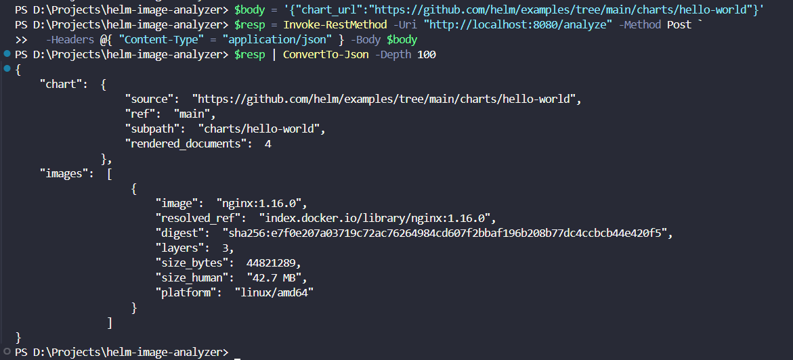
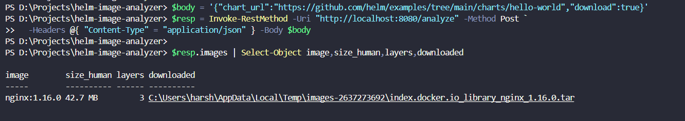
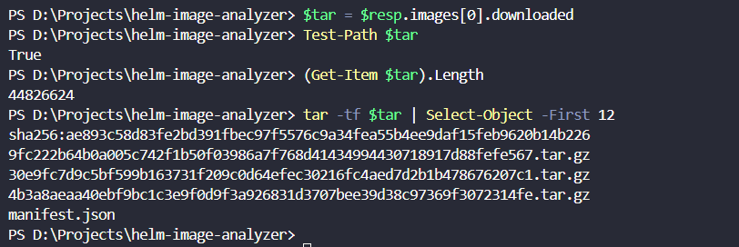

# Helm Image Analyzer (Go)

Small HTTP API that takes a Helm chart, renders it with `helm template`, finds all container images, and returns each image’s digest, compressed size, and layer count. It can also download images as Docker-compatible `.tar` files - no Docker daemon required.

## Preview

<details open>
<summary><strong>Screenshots (click any image for full size)</strong></summary>

<p align="center">
  <a href="./01-server-listening.png">
    
  </a>
</p>
<p align="center"><em>1) Server started — listening on <code>:8080</code>.</em></p>

<p align="center">
  <a href="./02-healthz-ok.png">
    
  </a>
</p>
<p align="center"><em>2) Health check — <code>GET /healthz</code> → <code>ok</code>.</em></p>

<p align="center">
  <a href="./03-analyze-metadata.png">
    
  </a>
</p>
<p align="center"><em>3) Analyze (metadata) — shows <code>digest</code>, <code>size_human</code>, <code>layers</code>, <code>platform</code>.</em></p>

<p align="center">
  <a href="./04-download-summary.png">
    
  </a>
</p>
<p align="center"><em>4) Analyze + download — summary of <code>image</code>, <code>size_human</code>, <code>layers</code>, <code>downloaded</code> path.</em></p>

<p align="center">
  <a href="./05-tar-listing.png">
    
  </a>
</p>
<p align="center"><em>5) Verifying download — <code>tar -tf &lt;file&gt;</code> shows contents.</em></p>

</details>


## What it does

* Accepts: GitHub `tree/...` URL, generic git URL, `.tgz` URL, or a local chart path
* Renders with `helm template` (no cluster calls)
* Scans `containers`, `initContainers`, and `ephemeralContainers`
* Targets a platform (default `linux/amd64`)
* Optional: download images to `.tar`
* Auth: uses your `~/.docker/config.json` (run `docker login <registry>` for private images)

## Requirements

* Go **1.23+**
* Helm **v3** in `PATH`
* (Optional) Docker login for private registries

## Run

**Local**

```bash
go build -o app ./main.go
./app            # listens on :8080
curl -s localhost:8080/healthz
```

**Docker**

```bash
docker build -t helm-image-analyzer:local .
docker run --rm -p 8080:8080 helm-image-analyzer:local
# if you plan to download images to host:
mkdir -p downloads
docker run --rm -p 8080:8080 -v "$PWD/downloads:/downloads" helm-image-analyzer:local
```

## API

### `POST /analyze`

Send **either** `chart_url` **or** `local_path`.

**Body fields**

* `chart_url` | `local_path`
* `ref` (git ref), `subpath` (chart dir inside repo/tgz)
* `values_yaml` (inline), `set` (map for `--set`)
* `platform` (default `linux/amd64`)
* `download` (bool)
* `download_dir` (if your build supports it)

**Example request**

```bash
curl -s localhost:8080/analyze \
  -H 'Content-Type: application/json' \
  -d '{"chart_url":"https://github.com/helm/examples/tree/main/charts/hello-world"}'
```

**Example response (trimmed)**

```json
{
  "chart": {
    "source": "https://github.com/helm/examples/tree/main/charts/hello-world",
    "ref": "main",
    "subpath": "charts/hello-world",
    "rendered_documents": 4
  },
  "images": [
    {
      "image": "nginx:1.16.0",
      "resolved_ref": "index.docker.io/library/nginx:1.16.0",
      "digest": "sha256:...",
      "layers": 3,
      "size_bytes": 44736512,
      "size_human": "42.7 MB",
      "platform": "linux/amd64",
      "downloaded": "/tmp/images-.../index.docker.io_library_nginx_1.16.0.tar"
    }
  ]
}
```

## Handy examples

* **Download images**

```bash
curl -s localhost:8080/analyze -H 'Content-Type: application/json' \
  -d '{"chart_url":"https://github.com/helm/examples/tree/main/charts/hello-world","download":true}'
```

* **Switch platform**

```bash
curl -s localhost:8080/analyze -H 'Content-Type: application/json' \
  -d '{"chart_url":"https://github.com/helm/examples/tree/main/charts/hello-world","platform":"linux/arm64"}'
```

* **Override values**

```bash
curl -s localhost:8080/analyze -H 'Content-Type: application/json' \
  -d '{"chart_url":"https://github.com/helm/examples/tree/main/charts/hello-world","values_yaml":"image:\n  tag: 1.25.5\n"}'
```

## Quick checks

1. `GET /healthz` → `ok`
2. `POST /analyze` on the hello-world chart returns at least one image with **size** and **layers**
3. With `"download": true`, the returned `.tar` exists and `tar -tf <file>` lists contents

**Notes:** Results are de-duplicated per request. Reported size is the sum of compressed layer sizes + config. Everything runs client-side: `helm template` + registry API.

